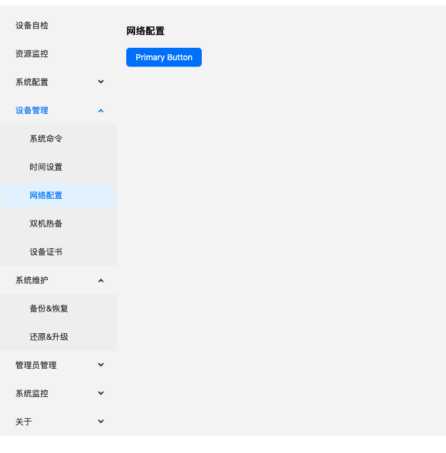
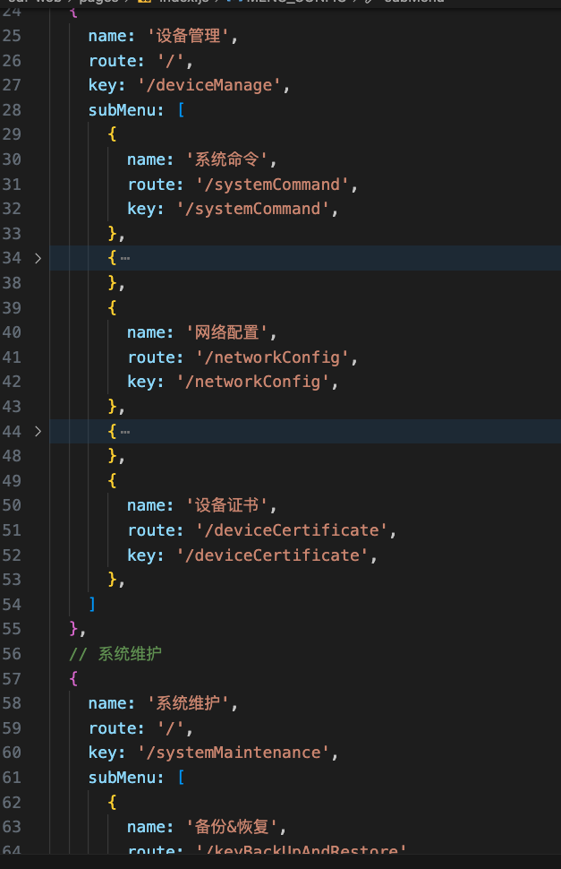

说明：众所周知，我们在新起一个项目的时候，都是要添加路由，和创建对应的文件夹，子文件夹，index.jsx文件的，如果菜单少倒还好，如果菜单比较多，每次的复制黏贴，复制黏贴，复制黏贴，消耗大量的时间，人力，物力，最最重要的事情是！！！影响我们开发人员的心情，让我觉得我就是个无脑工具人，这种简单，无脑，但又不能搞错的工作，真的是很令人生气，在极大的程度上消耗我们的耐心

所以，简单写个小工具来做这件事情吧

参考地址： [源文件地址](https://github.com/iProgramme/popular_tools/blob/main/generateMenusFinder/index.js)
文档地址： [GitHub文档地址](https://github.com/iProgramme/popular_tools/tree/main/generateMenusFinder) [博客文档地址](http://yubowen2003.top/MyBlog/posts/82f8bd45.html)

### 项目生成脚本


这是一个用于生成 React 项目结构的脚本。脚本会根据给定的菜单配置生成文件夹和文件，每个文件夹包含一个基本的 React 组件。

效果图如下



配置文件如下



### 如何使用

1. **运行脚本**

   执行以下命令：

   ```bash
   node index.js
   ```

   这将根据 `MENU_CONFIG` 数据生成项目结构。

### 菜单配置

```javascript
// 在 generateFiles.js 中的 MENU_CONFIG 数据
const MENU_CONFIG = [
  // ... 你的菜单配置
];
```

### 文件结构

生成的文件结构如下：

```
- SystemConfig
  - SystemInfo
    - index.jsx
  - WhiteList
    - index.jsx
- DeviceManage
  - SystemCommand
    - index.jsx
  - TimeSetting
    - index.jsx
  - NetworkConfig
    - index.jsx
  - DoubleHotBackup
    - index.jsx
  - DeviceCertificate
    - index.jsx
- SystemMaintenance
  - KeyBackUpAndRestore
    - index.jsx
  - RestoreAndUpgrade
    - index.jsx
- AdminManage
  - AdminList
    - index.jsx
  - AdminStrategy
    - index.jsx
- SystemMonitor
  - OnlineUser
    - index.jsx
  - ScheduledTask
    - index.jsx
  - DeviceMonitor
    - index.jsx
  - MonitorThreshold
    - index.jsx
- About
  - LicenseInfo
    - index.jsx
```

### 注意事项

- 请确保在运行脚本之前备份任何重要数据，因为脚本会覆盖已存在的文件夹和文件。
- 你可以根据需要调整生成的组件代码和文件夹结构。
- 若要使用 ES6 模块语法，请确保正确配置 Babel，可以参考 Babel 文档进行配置。
- ***目前只支持二级菜单配置项的生成，只有一级菜单暂不支持，有三级菜单也不支持，原因：暂时没需求，懒得搞，可自行更改就行***

### 示例代码

以下是生成的每个组件的简单示例代码：

```jsx
// SystemInfo/index.jsx
import React from 'react';
import { Button } from 'antd';

const SystemInfo = () => {
  return (
    <div>
      <h1> SystemInfo </h1>
      <Button type="primary">Primary Button</Button>
    </div>
  );
};

export default SystemInfo;
```

你可以在每个组件的 `index.jsx` 中添加具体的页面内容。